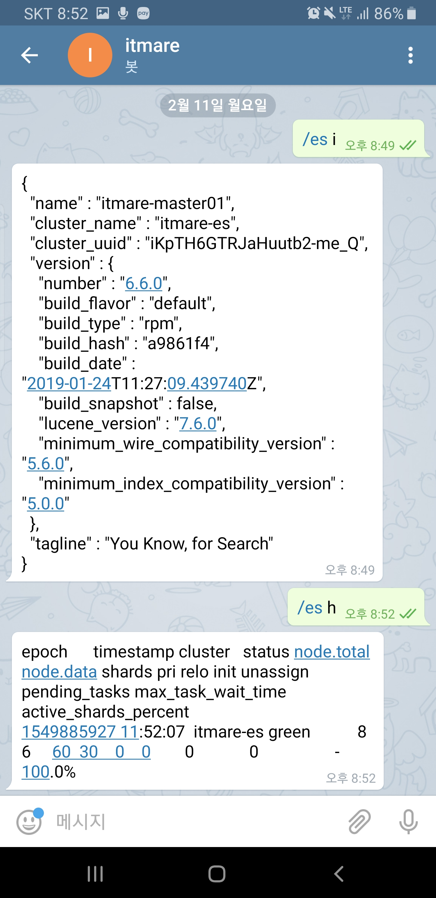
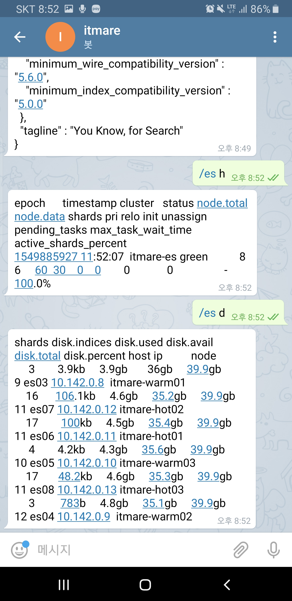
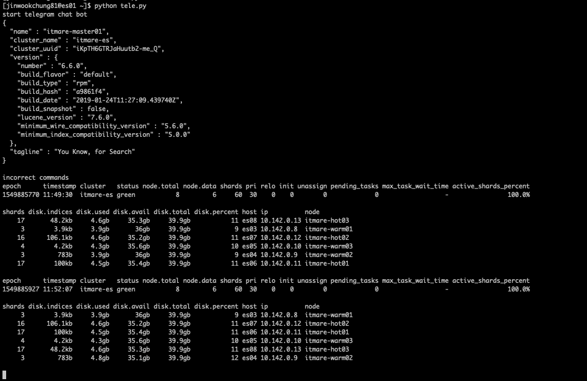

Telegram을 활용한 ElasticsSearch Cluster 모니터링 방법
======================================================

<br><br>

Telegram: The Botfather
-----------------------


<br><br>

-	bot father를 이용하여 만들어둔 es 스크립트 연결
-	외부에서 bot을 통해 es클러스터 접근 가능
-	telegram에서 BotFather 검색
-	/newbot으로 봇 생성 시도
-	<xxxxxxxx>\_bot 또는 <xxxxxxxx>bot 이라는 이름으로 봇 생성
-	리턴된 키를 tele.py에 복사

```shell
$ sudo pip install python-telegram-bot

$ python tele.py
```

<br><br>

### telegram bot father API 생성


<br><br>

### telegram mobile을 통한 모니터링





<br><br>

### telegram으로 메시지 보낼 시, terminal view


